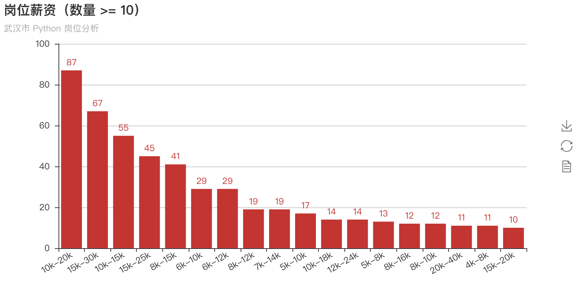

# wuhan-python

武汉市 Python 岗位分析，数据来源拉勾网，抓取时间为 2018 年 09 月 13 日。

**请注意，数据具有实效性，图标呈现内容不一定代表现状。**

# 使用

使用 Docker 安装 jupyter/scipy-notebook，运行：

```
docker run --name sklearn -p 127.0.0.1:8888:8888 jupyter/scipy-notebook
```

在浏览器中打开 `http://127.0.0.1:8888`，在 Jupyter 中打开一个 Terminal，安装 pyecharts：

```
pip install pyecharts
```

在 Jupyter 中上传本项目中的 `.ipynb` 笔记本文件和 `.json` 数据文件，注意上传到同一目录，打开笔记本文件运行即可。

# 统计图表

## 需求区域分布


## 招聘企业情况


## 岗位情况





# 参考链接

- [数据报告-用户研究岗位分析报告 - 简书](https://www.jianshu.com/p/13ba5d7629ea)
- [[python,pandas]数据分析求职指南——猎聘网数据分析职位解析](https://zhuanlan.zhihu.com/p/30656427)